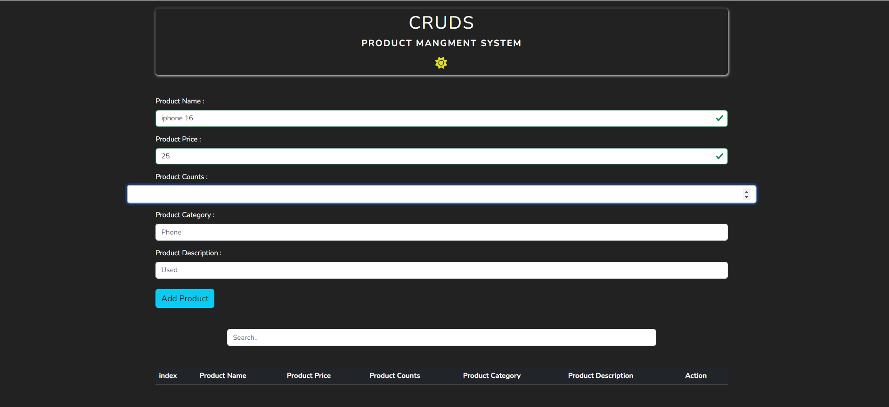

# CRUDS-SYSTEM

## Table of contents
- [Overview](#overview)
- [Screenshot](#screenshot)
- [Links](#links)
- [Technologies Used](#Technologies-Used)
- [What I learned](#what-i-learned)
- [Author](#author)

## Overview
1. **CRUD Operations**: Easily create, update, and delete products with a streamlined interface.
2. **Search Functionality**: Filter products by title or category to quickly find what you need.
3. **Responsive Design**: Fully optimized for all devices, ensuring a seamless experience whether you're on a phone, tablet, or desktop.
4. **Dark/Light Mode Toggle**: Switch between dark and light themes to suit your preference.
   
## Screenshot

### Dark Mode:

### Light Mode:

## Links
- [Live Demo](https://mmostafa1999.github.io/Product-management-system/) 🌟
- [Documentation](https://github.com/Mmostafa1999/Product-management-system) 🌟

## Technologies Used
- Semantic HTML5 markup
- CSS custom properties
- Bootstrap
- JS [ES6]

## What I learned
I learn how to make a website with HTML & CSS and Bootstap ,style the elements , how to position the elements and how to make the website responsive, make the website dynamic wih javascript

## Author
- **Name**: Mahmoud Mostafa Dardier
- **Contact**: [Gmail](mahmoud.mostafa4467@gmail.com)

